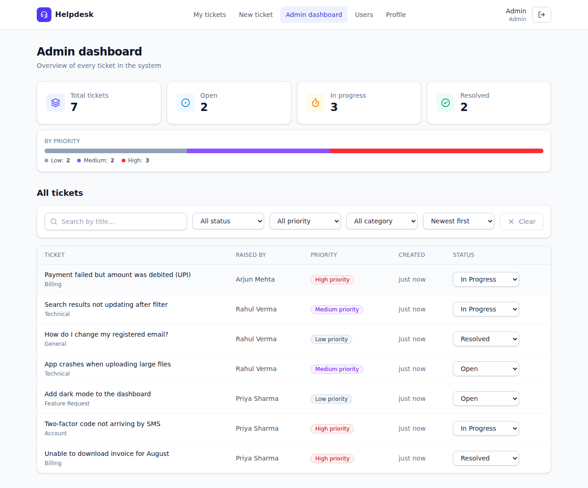
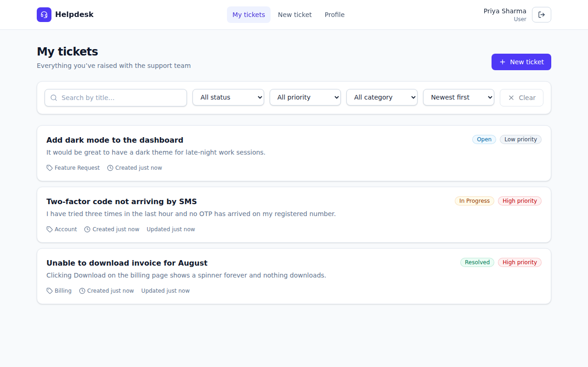
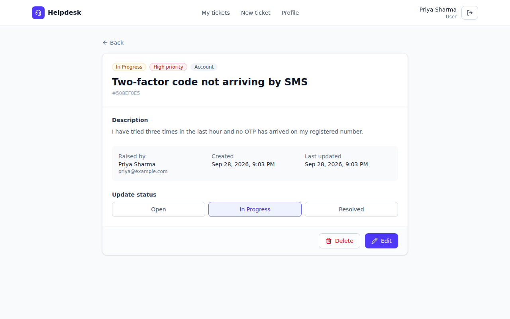
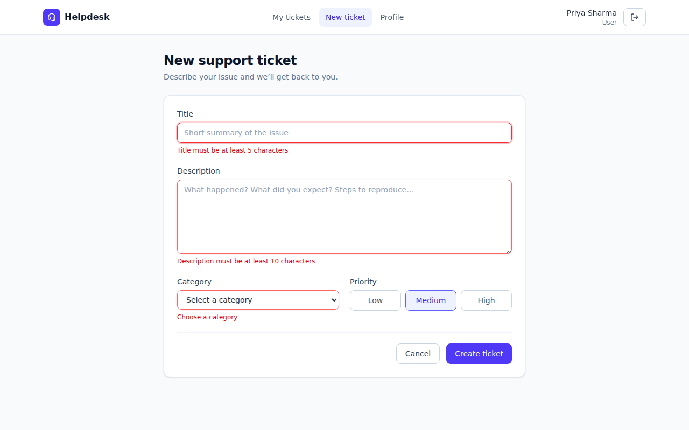
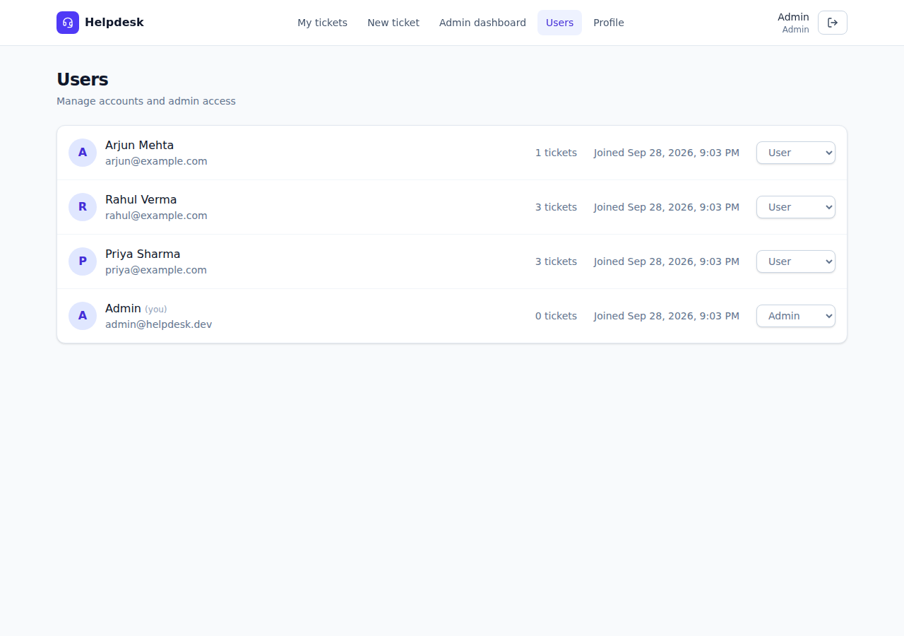
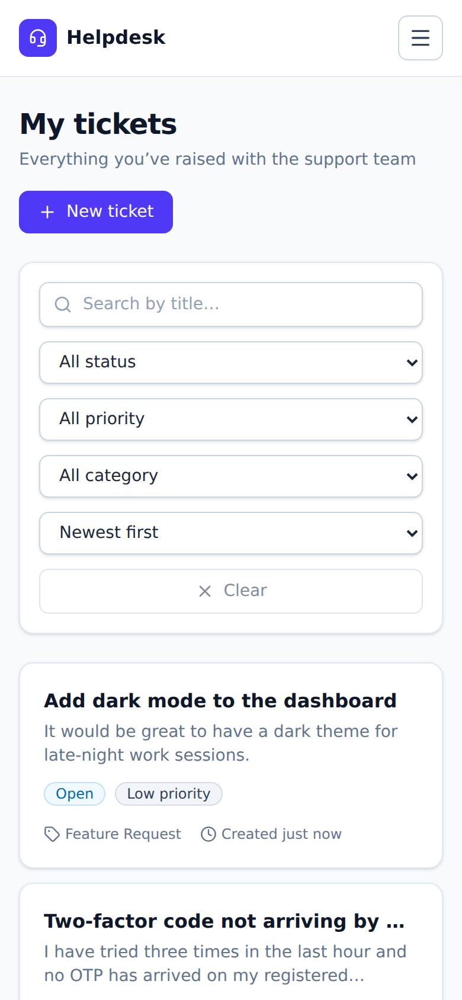
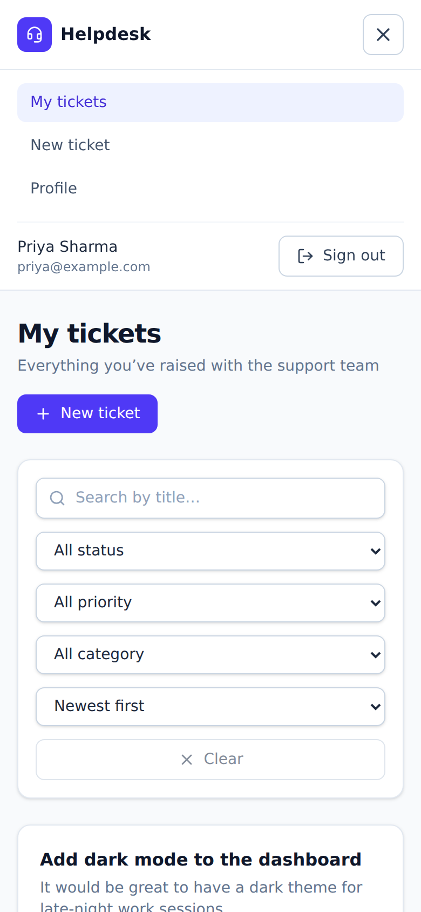

# Helpdesk: Support Ticket System

A full-stack app where users raise and track support tickets, and admins manage all tickets from a dashboard.

**Live demo:** _add link_ · **Demo logins:** Admin `admin@helpdesk.dev` / `Admin@12345` · User `priya@example.com` / `Password123`



## Features
- **Auth:** register, login, logout, JWT, bcrypt password hashing, protected routes, user/admin roles
- **Tickets:** create, view, edit, update status, delete. Search, filters and pagination.
- **Admin:** all tickets, filter by status and priority, search by title, update status, stats (Total / Open / In Progress / Resolved), user roles
- **UI:** responsive and mobile-friendly, with form validation and loading/error states

## Tech stack
React 19 · TypeScript · Vite · Tailwind CSS · Node.js · Express 5 · MongoDB (Mongoose) · Zod · JWT · Vitest

## Setup

**Requirements:** Node.js 18+ and MongoDB (local or [Atlas](https://cloud.mongodb.com))

```bash
# 1. Database (macOS). Or use a MongoDB Atlas connection string instead.
brew tap mongodb/brew && brew install mongodb-community
brew services start mongodb-community

# 2. Backend: http://localhost:5001
cd server
cp .env.example .env
npm install
npm run seed:admin      # creates the admin user
npm run seed:demo       # optional sample data
npm run dev

# 3. Frontend: http://localhost:5173 (in a new terminal)
cd client
npm install
npm run dev
```

**Run tests:** `cd server && npm test`

## Environment variables (`server/.env`)

| Variable | Example |
| --- | --- |
| `MONGODB_URI` | `mongodb://127.0.0.1:27017/helpdesk` |
| `JWT_SECRET` | any long random string |
| `JWT_EXPIRES_IN` | `1d` |
| `PORT` | `5001` |
| `CLIENT_URL` | `http://localhost:5173` |
| `ADMIN_EMAIL` / `ADMIN_PASSWORD` | used by `npm run seed:admin` |

For a deployed frontend, set `VITE_API_URL=https://your-api-url/api` in `client/.env`.

## API endpoints
All routes start with `/api`. Protected routes need the header `Authorization: Bearer <token>`.

| Method | Endpoint | Access | Description |
| --- | --- | --- | --- |
| POST | `/auth/register` | Public | Register |
| POST | `/auth/login` | Public | Login |
| POST | `/auth/logout` | User | Logout |
| GET | `/auth/me` | User | Current user |
| PATCH | `/users/me` | User | Update name |
| PATCH | `/users/me/password` | User | Change password |
| GET | `/tickets` | User | My tickets (`?status&priority&search&page`) |
| POST | `/tickets` | User | Create ticket |
| GET | `/tickets/:id` | Owner / Admin | Ticket details |
| PATCH | `/tickets/:id` | Owner / Admin | Update ticket or status |
| DELETE | `/tickets/:id` | Owner / Admin | Delete ticket |
| GET | `/admin/tickets` | Admin | All tickets (filter and search) |
| PATCH | `/admin/tickets/:id/status` | Admin | Update status |
| GET | `/admin/stats` | Admin | Ticket statistics |
| GET | `/admin/users` | Admin | All users |
| PATCH | `/admin/users/:id/role` | Admin | Change user role |

## Screenshots

| My tickets | Ticket details |
| --- | --- |
|  |  |
| **Form validation** | **Admin users** |
|  |  |

**Mobile**

 

## Notes
- The database needs no manual setup. Collections and indexes are created automatically.
- Public sign-up always creates a normal user. Admins come from `npm run seed:admin`.
- Users can only access their own tickets. Every request is validated on the server.
- On macOS, port 5000 is used by AirPlay, so the API runs on **5001**.
